# Rapport de TP 1 — Analyse statique (SAST) et sécurité des dépendances (SCA)

**Projet :** Vulnerable Notes (API Flask volontairement vulnérable)  
**Outils :** Bandit (SAST) · OWASP Dependency-Check (SCA) · Docker · Git  
**Objectif :** appliquer l’approche *shift-left* : détecter et corriger des failles **avant** le déploiement.

> Les captures d’écran sont dans le dossier [`screenshots/`](screenshots/).  
> Les rapports bruts des scanners sont dans [`reports/`](reports/).

---

## 1. Comprendre le « shift-left »

En sécurité classique, on teste souvent **après** le développement (voire en production).  
Le *shift-left* consiste à déplacer les contrôles **vers la gauche** du cycle de vie : dès l’écriture du code et de la déclaration des dépendances.

Dans ce TP, cela signifie :

1. écrire / lancer l’application localement (Docker) ;
2. scanner le **code source** (SAST) ;
3. scanner les **dépendances** (SCA) ;
4. corriger ;
5. **re-scanner** pour prouver que les alertes ont disparu.

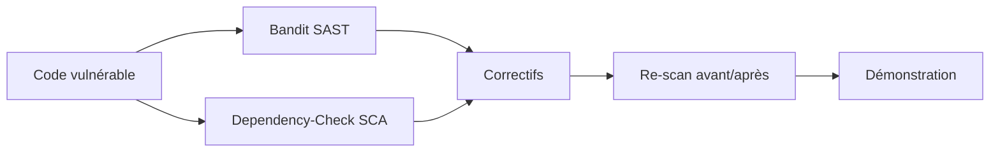

---

## 2. Mise en place de l’environnement

### 2.1 Structure du dépôt

Application Python Flask minimale, un `Dockerfile`, un `requirements.txt`, puis les dossiers `reports/` et `screenshots/`.

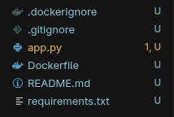

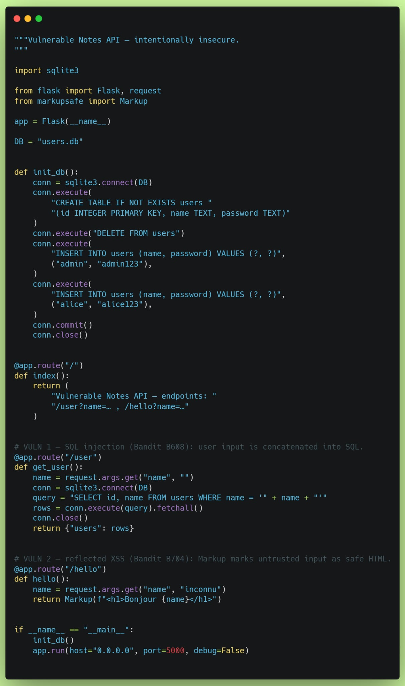

### 2.2 Image Docker

Commandes utilisées :

```bash
docker build -t vulnerable-notes .
docker rm -f notes 2>/dev/null
docker run -d --rm -p 5000:5000 --name notes vulnerable-notes
```

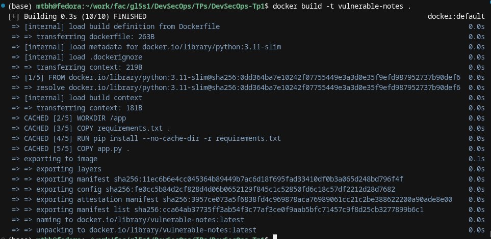

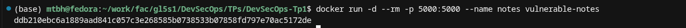

### 2.3 Reproduction des failles (avant correctifs)

**Lookup normal** — seul `admin` est renvoyé :

```bash
curl -s --get "http://localhost:5000/user" --data-urlencode "name=admin"
```

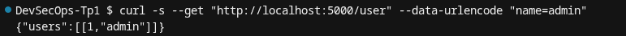

**Injection SQL** — la charge `' OR '1'='1` renvoie **tous** les utilisateurs (`admin` et `alice`) :

```bash
curl -s --get "http://localhost:5000/user" --data-urlencode "name=' OR '1'='1"
```

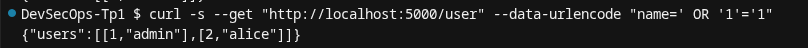

**XSS réfléchi** — le navigateur / `curl` reçoit le `<script>` **non échappé** :

```bash
curl -s --get "http://localhost:5000/hello" \
  --data-urlencode "name=<script>alert(1)</script>"
```

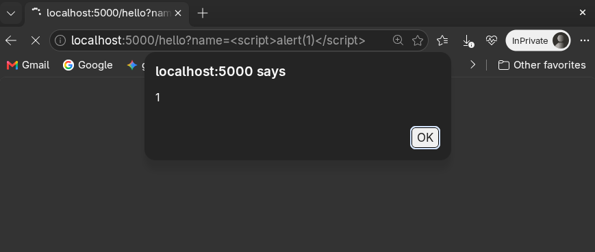

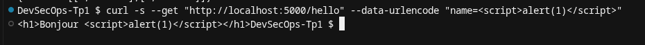

**Pourquoi c’est grave :**

| Faille | Cause dans le code | Impact |
|--------|--------------------|--------|
| Injection SQL | Concaténation de `name` dans la requête SQL | Lecture (voire modification) de données non autorisées |
| XSS | `markupsafe.Markup` sur une entrée utilisateur | Exécution de JavaScript dans le navigateur de la victime |

---

## 3. Analyse statique (SAST) avec Bandit

### 3.1 Lancement du scan

```bash
mkdir -p reports

docker run --rm -v "$PWD":/src python:3.11-slim sh -c \
  "pip install -q bandit && bandit -r /src/app.py -f txt" \
  | tee reports/bandit-avant.txt
```

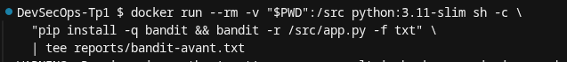

### 3.2 Rapport Bandit — AVANT correctifs

Fichier : [`reports/bandit-avant.txt`](reports/bandit-avant.txt)

```text
Run started:2026-10-07 22:40:59.198539+00:00

Test results:
>> Issue: [B608:hardcoded_sql_expressions] Possible SQL injection vector through string-based query construction.
   Severity: Medium   Confidence: Low
   CWE: CWE-89 (https://cwe.mitre.org/data/definitions/89.html)
   More Info: https://bandit.readthedocs.io/en/1.9.4/plugins/b608_hardcoded_sql_expressions.html
   Location: /src/app.py:48:12
47	    conn = sqlite3.connect(DB)
48	    query = "SELECT id, name FROM users WHERE name = '" + name + "'"
49	    rows = conn.execute(query).fetchall()

--------------------------------------------------
>> Issue: [B704:markupsafe_markup_xss] Potential XSS with ``markupsafe.Markup`` detected. Do not use ``Markup`` on untrusted data.
   Severity: Medium   Confidence: High
   CWE: CWE-79 (https://cwe.mitre.org/data/definitions/79.html)
   More Info: https://bandit.readthedocs.io/en/1.9.4/plugins/b704_markupsafe_markup_xss.html
   Location: /src/app.py:58:11
57	    name = request.args.get("name", "inconnu")
58	    return Markup(f"<h1>Bonjour {name}</h1>")
59	

--------------------------------------------------
>> Issue: [B104:hardcoded_bind_all_interfaces] Possible binding to all interfaces.
   Severity: Medium   Confidence: Medium
   CWE: CWE-605 (https://cwe.mitre.org/data/definitions/605.html)
   More Info: https://bandit.readthedocs.io/en/1.9.4/plugins/b104_hardcoded_bind_all_interfaces.html
   Location: /src/app.py:63:17
62	    init_db()
63	    app.run(host="0.0.0.0", port=5000, debug=False)

--------------------------------------------------

Code scanned:
	Total lines of code: 46
	Total lines skipped (#nosec): 0
	Total potential issues skipped due to specifically being disabled (e.g., #nosec BXXX): 0

Run metrics:
	Total issues (by severity):
		Undefined: 0
		Low: 0
		Medium: 3
		High: 0
	Total issues (by confidence):
		Undefined: 0
		Low: 1
		Medium: 1
		High: 1
Files skipped (0):
```

### 3.3 Interprétation des alertes

| ID Bandit | CWE | Signification | Mission TP |
|-----------|-----|---------------|------------|
| **B608** | CWE-89 | Injection SQL probable | **Oui — corrigée** |
| **B704** | CWE-79 | XSS via `Markup` | **Oui — corrigée** |
| **B104** | CWE-605 | Écoute sur toutes les interfaces (`0.0.0.0`) | Traité (hôte via variable d’environnement) |

**Limite de Bandit :** c’est un analyseur de motifs / règles, pas un moteur de flux de données complet. Il signale des *patterns* dangereux ; la preuve d’exploitabilité vient aussi des tests `curl` ci-dessus.

### 3.4 Correctifs appliqués

Diff des changements dans `app.py` :

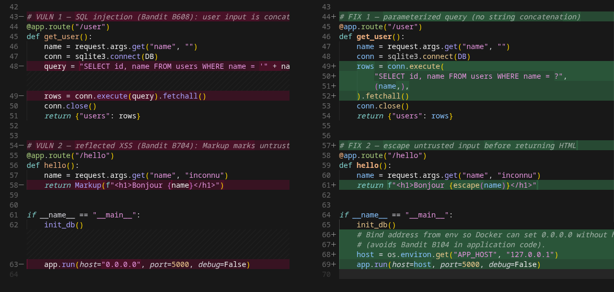

**Injection SQL — avant :**

```python
query = "SELECT id, name FROM users WHERE name = '" + name + "'"
rows = conn.execute(query).fetchall()
```

**Injection SQL — après (requête paramétrée) :**

```python
rows = conn.execute(
    "SELECT id, name FROM users WHERE name = ?",
    (name,),
).fetchall()
```

**XSS — avant :**

```python
return Markup(f"<h1>Bonjour {name}</h1>")
```

**XSS — après (échappement) :**

```python
from markupsafe import escape
return f"<h1>Bonjour {escape(name)}</h1>"
```

**Bind `0.0.0.0` :** le code lit `APP_HOST` (défaut `127.0.0.1`). Dans le `Dockerfile`, `ENV APP_HOST=0.0.0.0` est nécessaire pour que le port publié par Docker (`-p 5000:5000`) fonctionne. On évite ainsi un bind-all **codé en dur** dans le source, tout en gardant un comportement adapté au conteneur.

### 3.5 Vérification fonctionnelle après correctifs

```bash
docker build -t vulnerable-notes .
docker run -d --rm -p 5000:5000 --name notes vulnerable-notes
```

- La charge SQL ne renvoie plus tous les utilisateurs.
- Le XSS apparaît échappé (`&lt;script&gt;…`).

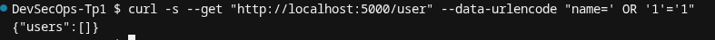

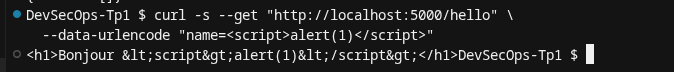

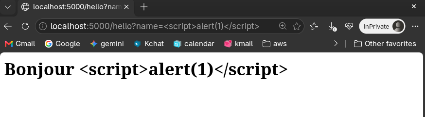

### 3.6 Rapport Bandit — APRÈS correctifs

Commande :

```bash
docker run --rm -v "$PWD":/src python:3.11-slim sh -c \
  "pip install -q bandit && bandit -r /src/app.py -f txt" \
  | tee reports/bandit-apres.txt
```

Fichier : [`reports/bandit-apres.txt`](reports/bandit-apres.txt)

```text
Run started:2026-10-07 23:31:07.846697+00:00

Test results:
	No issues identified.

Code scanned:
	Total lines of code: 50
	Total lines skipped (#nosec): 0
	Total potential issues skipped due to specifically being disabled (e.g., #nosec BXXX): 0

Run metrics:
	Total issues (by severity):
		Undefined: 0
		Low: 0
		Medium: 0
		High: 0
	Total issues (by confidence):
		Undefined: 0
		Low: 0
		Medium: 0
		High: 0
Files skipped (0):
```

**Résultat :** les alertes B608, B704 et B104 ne sont plus signalées.

---

## 4. Analyse des dépendances (SCA) avec OWASP Dependency-Check

### 4.1 Clé API NVD (recommandée)

Sans clé, le premier téléchargement de la base NVD est très long.  
Création d’une clé sur le site NVD, puis export local (jamais commitée dans Git) :

```bash
export NVD_API_KEY="votre-clé"
```


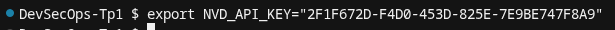

### 4.2 Premier scan — constats

Premier essai sans dépendance « bien mappée » par ODC : **0 CVE** sur Flask/Jinja2/Werkzeug, alors que ces versions anciennes peuvent pourtant avoir des avis connus.  
Cela illustre une **limite du SCA** : l’outil ne voit que ce qu’il sait corréler (CPE / NVD / bases branchées).

Pour obtenir une alerte **fiable et démontrable** avec Dependency-Check, une dépendance classiquement reconnue a été épinglée : **`PyYAML==5.3.1`**.

### 4.3 Scan SCA — AVANT mise à jour

```bash
mkdir -p reports .odc-data

docker run --rm \
  -v "$PWD":/src \
  -v "$PWD/reports":/report \
  -v "$PWD/.odc-data":/usr/share/dependency-check/data \
  owasp/dependency-check \
  --scan /src \
  --enableExperimental \
  --format HTML --format JSON \
  --out /report \
  --project vulnerable-notes \
  --nvdApiKey "$NVD_API_KEY"
```

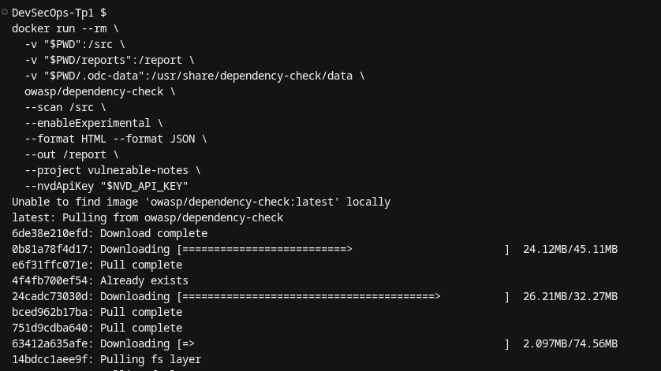

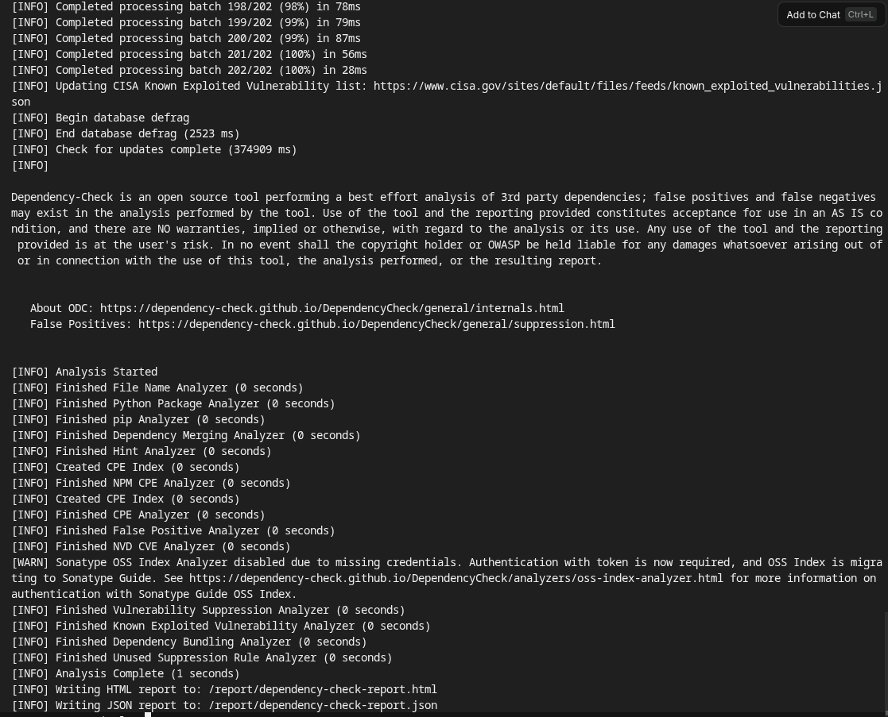

Rapports sauvegardés :  
[`reports/dependency-check-avant.html`](reports/dependency-check-avant.html) ·  
[`reports/dependency-check-avant.json`](reports/dependency-check-avant.json)

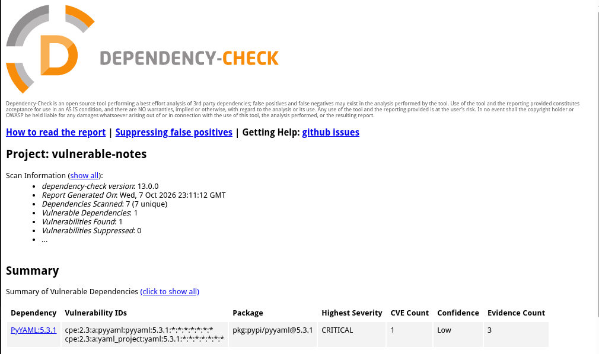

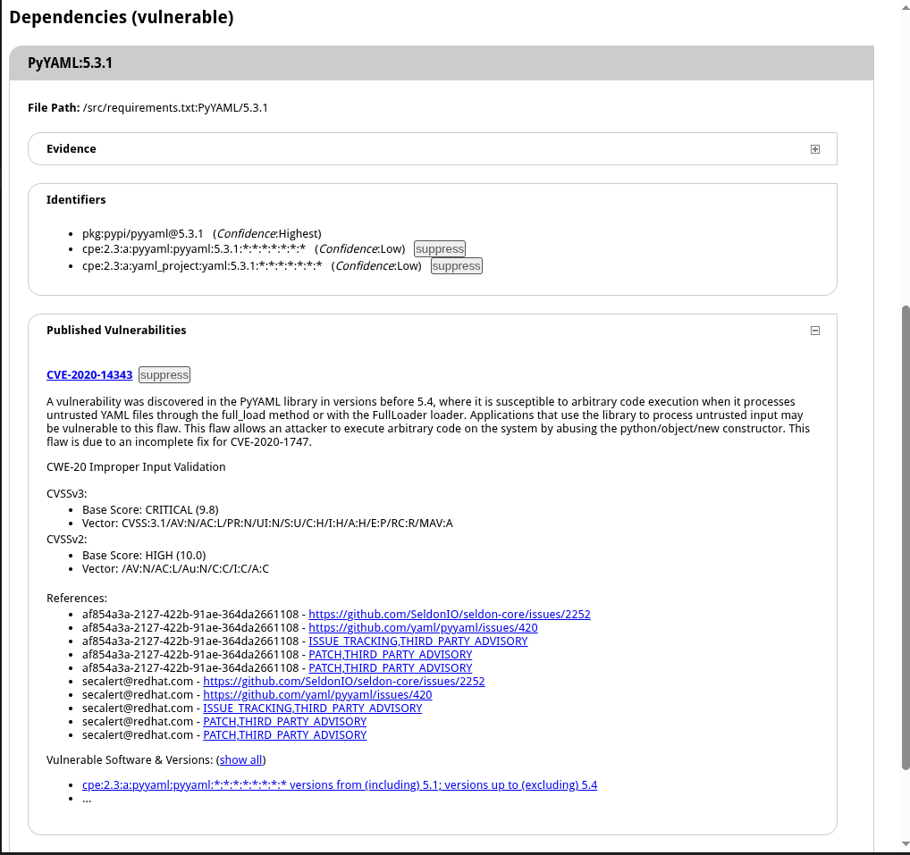

### 4.4 Vulnérabilité identifiée

| Champ | Valeur |
|-------|--------|
| Dépendance | **PyYAML 5.3.1** |
| CVE | **CVE-2020-14343** |
| Sévérité | **CRITICAL** |
| Problème | Exécution de code arbitraire lors du traitement de YAML non fiable (`full_load` / Loader non sûr) dans les versions **&lt; 5.4** |
| Remédiation | Mettre à jour vers une version corrigée |

**Pourquoi mettre à jour est nécessaire :** on ne « patch » pas soi-même une bibliothèque tierce de façon fiable. La correction maintenue par le projet amont (nouvelle version) est la remédiation standard en SCA.

### 4.5 Correctif SCA

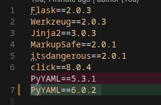

```text
# avant
PyYAML==5.3.1

# après
PyYAML==6.0.2
```

### 4.6 Scan SCA — APRÈS mise à jour

Même commande Dependency-Check, puis renommage des rapports en `dependency-check-apres.*`.

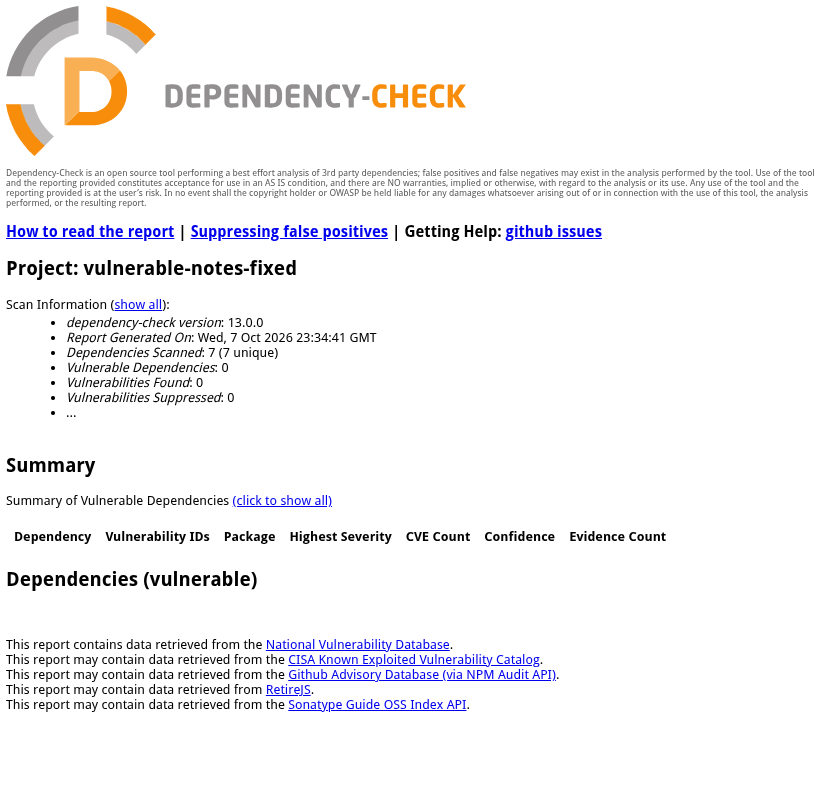

Rapports :  
[`reports/dependency-check-apres.html`](reports/dependency-check-apres.html) ·  
[`reports/dependency-check-apres.json`](reports/dependency-check-apres.json)

**Résultat :** `pkg:pypi/pyyaml@6.0.2` → **0 vulnérabilité** (CVE-2020-14343 absente).

---

## 5. Démonstration et synthèse

### 5.1 Avant / après

| Contrôle | Avant | Après |
|----------|-------|-------|
| Bandit | 3 issues Medium (B608, B704, B104) | **No issues identified** |
| `curl` SQLi | Tous les users renvoyés | Charge traitée comme un nom littéral (pas d’injection) |
| `curl` XSS | `<script>` brut | Contenu échappé (`&lt;script&gt;`) |
| Dependency-Check | PyYAML 5.3.1 → **CVE-2020-14343** CRITICAL | PyYAML 6.0.2 → **0 CVE** |

### 5.2 Ce que le TP a permis d’apprendre

1. **SAST** trouve des motifs dangereux **dans le code** (sans forcément exécuter l’app).  
2. **SCA** trouve des failles **publiées** dans les dépendances (CVE / NVD).  
3. Les deux sont complémentaires : du code « propre » avec une lib vulnérable reste dangereux, et l’inverse aussi.  
4. La preuve attendue en DevSecOps : **scan → correctif → re-scan**.

### 5.3 Limites rencontrées

- **Bandit** : règles + confiance variable (ex. B608 en *Low confidence*) ; à croiser avec un test manuel.  
- **Dependency-Check** : mapping imparfait pour certaines libs PyPI (premier scan à 0 CVE sur Flask/Jinja2) ; PyYAML a permis une démonstration claire.  
- **Docker + B104** : écouter sur `0.0.0.0` peut rester nécessaire **dans le conteneur** ; le risque réel dépend aussi de la publication des ports (`-p`) et du réseau hôte.

---

## 6. Fichiers de preuve

| Fichier | Rôle |
|---------|------|
| `reports/bandit-avant.txt` | SAST avant |
| `reports/bandit-apres.txt` | SAST après |
| `reports/dependency-check-avant.html` / `.json` | SCA avant (CVE-2020-14343) |
| `reports/dependency-check-apres.html` / `.json` | SCA après |
| `screenshots/` | Captures d’écran de chaque étape |

---

## Conclusion

Le TP valide les objectifs du sujet :

- approche **shift-left** appliquée avec Docker + scanners locaux ;  
- **au moins deux** vulnérabilités SAST (injection SQL, XSS) identifiées, corrigées et absentes du second rapport Bandit ;  
- **au moins une** dépendance vulnérable (PyYAML / CVE-2020-14343) mise à jour, avec disparition de l’alerte SCA.
